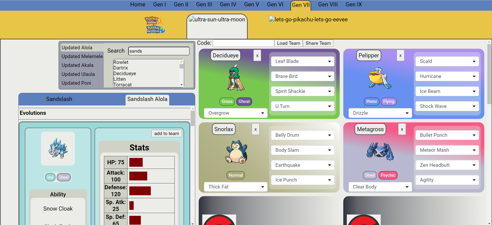
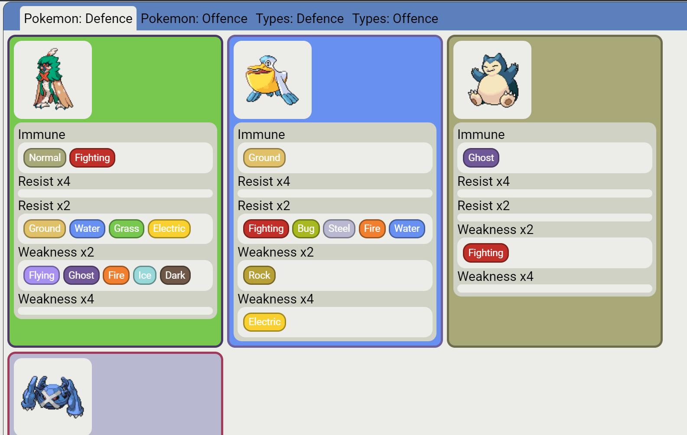

# [PokeTeam](https://bransonlj.github.io/PokeTeam/)

PokeTeam is an all in one team planner and builder web-application for Pokemon with support for all main series games. PokeTeam allows you to view information of Pokemon while planning your team and lets you share your team with others!

    

## Features
* Quick and easy sharing of pokemon teams with others via team code.
* Regional Pokedexes for each version to easily see what Pokemon are available to use.
* View stats, movesets, abilities and other information.
* Team Analytics: See what types your team is weak or strong against to help you improve your team!

    

# Acknowledgements
* All Pokemon and game information were obtained through [PokeApi](https://pokeapi.co/)
* Type colours and design inspiration from [Bulbapedia](https://bulbapedia.bulbagarden.net/wiki/Main_Page)
* This app was made with [React](https://react.dev/)
